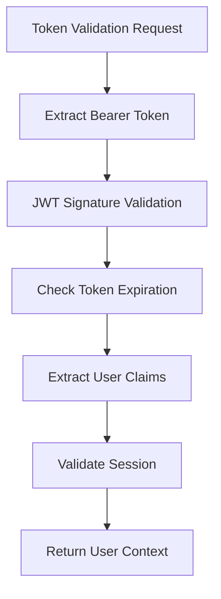

# Authentication Architecture

**Version**: 0.9.0 | **Updated**: September 17, 2025

Authentication service architecture for FLEXT ecosystem using **[flext-core](../../flext-core/README.md)** patterns and modern authentication practices.

---

## Overview

flext-auth implements authentication using FLEXT architectural patterns from [flext-core](../../flext-core/README.md). The implementation provides JWT token management, bcrypt password security, and session handling while integrating with flext-core foundation patterns.

**Implementation Scale**: 2,169 lines across 8 modules
**Test Status**: 611 passing, 17 failing, 88 errors (85% pass rate, mixed coverage)
**Integration**: Strong flext-core pattern compliance (FlextResult, FlextContainer)

---

## Service Architecture

### FlextAuth Service (auth.py - 555 lines)

Main authentication orchestrator implementing FLEXT patterns:

```python
class FlextAuth:
    """Authentication service using FLEXT patterns."""

    def __init__(self, config=None, container=None):
        self.config = config or FlextAuthConfig.get_global_instance()
        self.container = container or FlextContainer.get_global()
        self._logger = FlextLogger(__name__)

    def register_user(self, username, email, password) -> FlextResult[User]:
        """User registration with validation and bcrypt hashing."""

    def authenticate_user(self, username, password) -> FlextResult[dict]:
        """Password verification and session creation."""

    def validate_token(self, token) -> FlextResult[dict]:
        """JWT token validation and payload extraction."""
```

**Key Features**:
- FlextContainer dependency injection integration
- FlextResult railway pattern for error handling
- bcrypt password hashing (12 rounds)
- In-memory session storage (development mode)

### Domain Models (models.py - 498 lines)

Domain models following FLEXT patterns:

```python
class FlextAuthModels:
    """Domain models following FLEXT patterns."""

    class User(FlextModels.Entity):
        username: str
        email: str
        password_hash: str
        roles: list[str]
        created_at: datetime

    class Session(FlextModels.Entity):
        user_id: str
        session_token: str
        expires_at: datetime
        is_active: bool

    class UserCreationRequest(BaseModel):
        username: str
        email: str
        password: str
```

**Domain Integration**:
- Extends FlextModels.Entity from flext-core
- Pydantic validation with custom validators
- Business logic methods returning FlextResult

### Configuration Management (config.py - 681 lines)

Authentication configuration with security settings:

```python
class FlextAuthConfig(FlextConfig):
    """Authentication configuration with security settings."""

    # JWT Settings
    jwt_secret_key: str = "dev-secret-key"
    jwt_expiry_minutes: int = 60
    jwt_algorithm: str = "HS256"

    # Security Settings
    bcrypt_rounds: int = 12
    max_failed_attempts: int = 5
    session_timeout_minutes: int = 120

    @classmethod
    def create_for_environment(cls, env: str) -> FlextResult["FlextAuthConfig"]:
        """Environment-specific configuration factory."""
```

**Configuration Features**:
- Extends FlextConfig base class
- Environment-aware settings
- Security parameter management
- Global singleton pattern

---

## Authentication Flow Architecture

### User Registration Flow

```mermaid
graph TD
    A[User Registration Request] --> B[Validate Input]
    B --> C[Check Username/Email Unique]
    C --> D[Hash Password (bcrypt)]
    D --> E[Create User Entity]
    E --> F[Store User]
    F --> G[Return FlextResult[User]]
```

**Implementation**:
1. Input validation using Pydantic models
2. Business rule validation (uniqueness checks)
3. Password hashing with bcrypt (12 rounds)
4. User entity creation with FlextModels.Entity
5. Storage in memory dictionary (development)
6. FlextResult return with success/failure

### Authentication Flow

```mermaid
graph TD
    A[Authentication Request] --> B[Find User by Username]
    B --> C[Verify Password (bcrypt)]
    C --> D[Generate JWT Token]
    D --> E[Create Session]
    E --> F[Return Session Data]
```

**Security Implementation**:
- Username lookup with case handling
- bcrypt password verification
- JWT token generation with HS256
- Session creation with expiration
- FlextResult error handling throughout

### Token Validation Flow



---

## Security Architecture

### Password Security

**Hashing Strategy**:
- bcrypt algorithm with 12 rounds (production setting)
- Salt generation per password
- Secure password verification
- No plaintext password storage

**Implementation**:
```python
def set_password(self, password: str) -> FlextResult[bool]:
    """Secure password hashing with bcrypt."""
    try:
        salt = bcrypt.gensalt()
        password_hash = bcrypt.hashpw(password.encode('utf-8'), salt)
        self.password_hash = password_hash.decode('utf-8')
        return FlextResult[bool].ok(True)
    except Exception as e:
        return FlextResult[bool].fail(f"Password hashing failed: {e}")
```

### JWT Token Security

**Token Configuration**:
- HS256 signing algorithm (symmetric key)
- Configurable expiration (default 60 minutes)
- Bearer token format support
- Signature verification on validation

### Session Management

**Current Implementation**:
- In-memory session storage (development)
- Session expiration tracking
- User-to-session mapping
- Manual session cleanup

**Production Considerations**:
- Redis session storage planned
- Distributed session management
- Automatic cleanup processes
- Session security hardening

---

## Integration Patterns

### FLEXT Core Integration

**Authentication-Specific FlextResult Usage**:
```python
def authenticate_user(username: str, password: str) -> FlextResult[dict]:
    """Authentication flow using FlextResult for error handling."""
    return (
        self._find_user(username)
        .flat_map(lambda user: self._verify_password(user, password))
        .flat_map(lambda user: self._create_session(user))
        .map(lambda session: self._format_response(session))
    )
```

**Dependency Injection**:
```python
def __init__(self, config=None, container=None):
    self.container = container or FlextContainer.get_global()
    self._logger = FlextLogger(__name__)
```

**Domain Modeling**:
```python
class User(FlextModels.Entity):
    """User entity following FLEXT domain patterns."""

    def verify_password(self, password: str) -> FlextResult[bool]:
        """Business logic with FlextResult error handling."""
```

### CLI Integration (cli.py - 262 lines)

**Click Integration**:
```python
@click.group()
@click.version_option()
def cli():
    """FLEXT Authentication CLI."""
    pass

@cli.command()
@click.option("--username", required=True)
@click.option("--email", required=True)
@click.option("--password", required=True)
def create_user(username: str, email: str, password: str) -> None:
    """Create user via CLI with FlextAuth service."""
```

---

## Current Limitations

### Test Coverage Issues

**Failing Tests** (66 of 250):
- CLI test runner setup problems
- Configuration override functionality
- Mock setup issues in authentication flows
- Edge case validation failures

**Root Causes**:
- Test fixture management needs improvement
- CLI testing infrastructure incomplete
- Configuration test isolation issues

### Missing Features

**Authentication Standards**:
- Multi-factor authentication (MFA/2FA)
- Single sign-on protocols (SAML, OAuth2/OIDC)
- LDAP/Active Directory integration
- WebAuthn passwordless authentication

**Security Enhancements**:
- Account lockout mechanisms
- Rate limiting and abuse protection
- Advanced audit logging
- Behavioral analysis patterns

### Storage Limitations

**Current State**:
- In-memory user storage (development only)
- Dictionary-based session management
- No persistence between restarts
- No distributed storage support

**Production Requirements**:
- Database user storage
- Redis session management
- Distributed cache integration
- Backup and recovery strategies

---

## Development Areas

### Priority 1: Test Stabilization

**Target**: Fix failing tests and improve pass rate (currently 73%)
- Fix CLI test infrastructure
- Improve configuration test isolation
- Enhance mock management
- Add integration test coverage

### Priority 2: Security Enhancements

**Modern Authentication Standards (2025)**:
- OIDC provider implementation for modern applications
- SAML service provider for enterprise SSO
- MFA with TOTP/HOTP support (PyOTP integration)
- WebAuthn for passwordless authentication

### Priority 3: Production Storage

**Storage Integration**:
- SQLAlchemy user repository
- Redis session storage
- Connection pooling
- Migration strategies

### Priority 4: Advanced Security

**Security Enhancements**:
- Account lockout after failed attempts
- Rate limiting with Redis backing
- Comprehensive audit logging
- Security event monitoring

---

## Future Architecture (2025 Modern Authentication Standards)

### Passwordless Authentication (WebAuthn/FIDO2)

```python
class WebAuthnProvider:
    """Passwordless authentication with WebAuthn/FIDO2."""

    def register_credential(self, user_id: str, credential: dict) -> FlextResult[str]:
        """Register WebAuthn credential for passwordless login."""

    def authenticate_webauthn(self, credential_response: dict) -> FlextResult[User]:
        """Authenticate user with WebAuthn credential."""

    def get_assertion_options(self, user_id: str) -> FlextResult[dict]:
        """Generate assertion options for WebAuthn authentication."""
```

### Modern Multi-Protocol Support

```python
class ModernAuthProvider:
    """2025 multi-protocol authentication provider."""

    def authenticate_oauth2_oidc(self, token: str) -> FlextResult[User]:
        """OAuth2/OIDC token validation with PKCE support."""

    def authenticate_saml(self, assertion: str) -> FlextResult[User]:
        """SAML 2.0 assertion processing."""

    def authenticate_mfa_totp(self, user_id: str, code: str) -> FlextResult[bool]:
        """Multi-factor authentication with TOTP/HOTP."""

    def authenticate_risk_based(self, context: dict) -> FlextResult[RiskAssessment]:
        """Risk-based authentication with behavioral analysis."""
```

### Enterprise Security & Analytics

```python
class EnterpriseSecurityAnalytics:
    """Advanced security monitoring and analytics."""

    def detect_anomalous_login(self, context: dict) -> FlextResult[RiskScore]:
        """AI-powered behavioral analysis for login patterns."""

    def enforce_adaptive_mfa(self, risk_score: float) -> FlextResult[MfaRequirement]:
        """Adaptive MFA based on risk assessment."""

    def audit_authentication_event(self, event: dict) -> FlextResult[None]:
        """Comprehensive audit logging for compliance."""
```

---

This architecture reflects the current implementation state as of September 17, 2025, providing a foundation for systematic enhancement toward modern authentication standards.