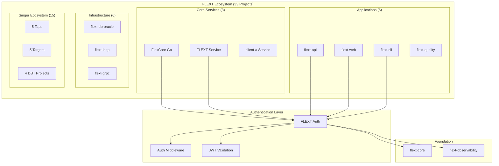
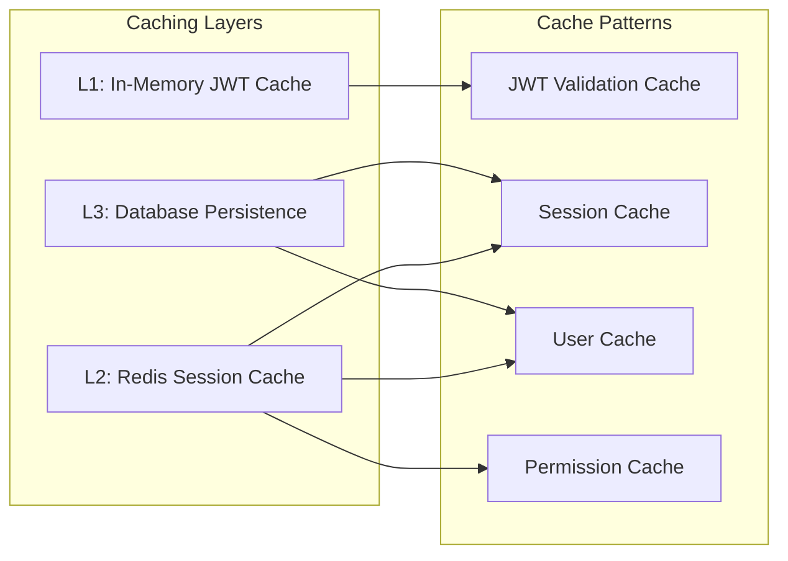
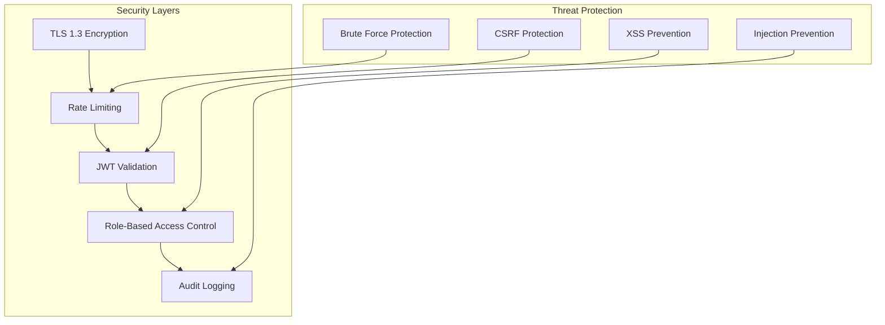

# Architecture Overview

**FLEXT Auth Clean Architecture Implementation with FLEXT Ecosystem Integration**

This document provides a comprehensive overview of the FLEXT Auth architecture, current implementation status, and the ongoing architectural refactoring to achieve full compliance with flext-core patterns.

---

## 🚨 Current Architectural Status

**Architecture Status**: 🔄 **MAJOR REFACTORING IN PROGRESS**  
**FLEXT Conformance**: 58/100 - Critical patterns missing  
**Production Readiness**: ❌ **NOT SUITABLE** - Architectural gaps identified

### Critical Architectural Analysis Results

After comprehensive analysis, significant deviations from FLEXT standards were identified:

**🔴 CRITICAL VIOLATIONS:**

- **FlextContainer Missing** - Zero dependency injection implementation
- **Domain Events Absent** - No FlextAggregateRoot or event sourcing
- **CQRS Not Implemented** - No command/handler patterns
- **Repository Pattern Incomplete** - Missing abstractions and interfaces

**🟡 SIGNIFICANT GAPS:**

- **Hardcoded Security Values** - JWT secrets and configuration issues
- **Limited Observability** - Basic logging only, no metrics/tracing
- **No Plugin Architecture** - Missing FLEXT extensibility patterns

### Design Principles (Target State)

- **flext-core Foundation**: Built on proven enterprise patterns (TO BE IMPLEMENTED)
- **Clean Architecture**: Clear separation of concerns (✅ PARTIALLY IMPLEMENTED)
- **Domain-Driven Design**: Rich business logic in domain layer (⚠️ MISSING EVENTS)
- **CQRS**: Command-query responsibility segregation (❌ NOT IMPLEMENTED)
- **Event Sourcing**: Complete audit trail for security operations (❌ NOT IMPLEMENTED)

---

## 🏗️ High-Level Architecture

### FLEXT Ecosystem Context



### Authentication Service Architecture

```mermaid
graph TB
    subgraph "Presentation Layer"
        REST[REST API Endpoints]
        MW[Middleware Components]
        HEALTH[Health Checks]
        METRICS[Metrics & Monitoring]
    end

    subgraph "Application Layer"
        CH[Command Handlers]
        AS[Authentication Services]
        AZ[Authorization Services]
        EP[Event Publishers]
    end

    subgraph "Domain Layer (flext-core patterns)"
        E[Entities: User, Session]
        VO[Value Objects: Username, Email]
        AGG[Aggregates: UserAggregate]
        DS[Domain Services: Password, Token]
        EVENTS[Domain Events]
    end

    subgraph "Infrastructure Layer"
        REPO[Repositories: User, Session, Token]
        EXT[External Services: LDAP, DB, Cache]
        ES[Event Store]
        CONFIG[Configuration Management]
    end

    subgraph "flext-core Foundation"
        FR[FlextResult[T]]
        FC[FlextContainer]
        FE[FlextEvents]
        FCM[FlextCommands]
    end

    REST --> CH
    MW --> AS
    CH --> E
    AS --> AGG
    AGG --> EVENTS
    REPO --> CONFIG
    ES --> FE
    CH --> FCM
    AS --> FR
```

---

## 🔄 Current vs Target Architecture

### Current Architecture (Beta - Issues Present)

**✅ Successfully Implemented:**

- Clean Architecture layer separation
- FlextResult[T] pattern in 15+ files
- Domain entities and value objects
- Basic configuration management

**⚠️ Partially Implemented:**

- Testing structure (exists but incomplete)
- Documentation (basic but inconsistent)
- Configuration patterns (some flext-core alignment)

**❌ Missing Critical Components:**

- FlextContainer dependency injection (CRITICAL GAP)
- Event sourcing and domain events
- CQRS command/handler patterns
- Comprehensive documentation
- Working test suite (all tests failing)

### Target Architecture (Post-Roadmap)

**Complete Integration Stack:**

```
┌─────────────────────────────────────────────────────────────┐
│                    FLEXT AUTH SERVICE                        │
├─────────────────────────────────────────────────────────────┤
│ API Gateway Layer                                            │
│ ├── Rate Limiting (60/min general, 5/min auth)              │
│ ├── Request Validation & CORS                               │
│ ├── JWT Middleware (<1ms validation)                        │
│ └── Audit Logging & Metrics                                 │
├─────────────────────────────────────────────────────────────┤
│ Application Services Layer                                   │
│ ├── AuthenticationService (login, logout, validate)         │
│ ├── AuthorizationService (RBAC, permissions)                │
│ ├── SessionService (lifecycle, concurrent limits)           │
│ ├── TokenService (JWT, refresh, revocation)                 │
│ └── EventService (audit trail, notifications)               │
├─────────────────────────────────────────────────────────────┤
│ CQRS Command Layer (flext-core integration)                 │
│ ├── Commands: LoginCommand, RegisterCommand                 │
│ ├── Handlers: LoginHandler, RegisterHandler                 │
│ ├── Validators: CommandValidationPipeline                   │
│ └── Middleware: Logging, Metrics, Caching                   │
├─────────────────────────────────────────────────────────────┤
│ Domain Layer (Rich Business Logic)                          │
│ ├── Aggregates: UserAggregate (event sourcing)             │
│ ├── Entities: FlextUser, FlextSession                       │
│ ├── Value Objects: FlextUsername, FlextEmail                │
│ ├── Domain Events: UserRegistered, LoginAttempted          │
│ └── Domain Services: PasswordPolicy, SecurityPolicy        │
├─────────────────────────────────────────────────────────────┤
│ Infrastructure Layer                                         │
│ ├── Repositories: UserRepo, SessionRepo (PostgreSQL)       │
│ ├── Event Store: Domain event persistence                   │
│ ├── Cache Layer: Redis (sessions, rate limits)             │
│ ├── External Integrations: LDAP, OAuth providers           │
│ └── Observability: Metrics, Tracing, Health Checks         │
├═════════════════════════════════════════════════════════════┤
│                      FLEXT CORE                              │
│ FlextResult | FlextContainer | FlextEvents | FlextCommands  │
└─────────────────────────────────────────────────────────────┘
```

---

## 🔌 Integration Patterns

### flext-core Integration

**FlextResult Pattern Usage:**

```python
# Type-safe authentication flow
async def authenticate_user(username: str, password: str) -> FlextResult[AuthenticatedUser]:
    return (
        validate_credentials(username, password)
        .flat_map(lambda creds: create_session(creds))
        .map(lambda session: generate_tokens(session))
    )
```

**FlextContainer Dependency Injection:**

```python
# Service registration (target implementation)
from flext_core import get_flext_container

container = get_flext_container()
container.register("auth_service", AuthenticationService)
container.register("user_repository", PostgreSQLUserRepository)
container.register("password_service", BCryptPasswordService)
```

**Domain Events and Event Sourcing:**

```python
# Event-driven domain logic (target)
class UserAggregate(FlextAggregateRoot):
    def login(self, password: str) -> FlextResult[Session]:
        if not self.verify_password(password):
            self.raise_event(LoginFailedEvent(self.id, timestamp=now()))
            return FlextResult.fail("Invalid credentials")

        session = self.create_session()
        self.raise_event(UserLoggedInEvent(self.id, session.id))
        return FlextResult.ok(session)
```

### Ecosystem Service Integration

**FastAPI Middleware:**

```python
# Authentication middleware for FLEXT services
from flext_auth import FlextAuthMiddleware

app = FastAPI()
app.add_middleware(
    FlextAuthMiddleware,
    auth_service=auth_service,
    exclude_paths=["/health", "/metrics"]
)
```

**Go-Python Bridge (FlexCore):**

```python
# Bridge pattern for Go services
class FlextAuthBridge:
    def validate_token(self, token: str) -> dict:
        result = auth_service.validate_jwt(token)
        return {
            "valid": result.success,
            "user_id": result.data.user_id if result.success else None,
            "error": result.error if not result.success else None
        }
```

---

## 📊 Performance Architecture

### Performance Targets

**Response Times:**

- JWT validation: <1ms average
- Authentication flow: <100ms average
- Session validation: <10ms average
- User registration: <200ms average

**Throughput:**

- 10,000+ concurrent users
- 1,000+ authentications per second
- 10,000+ JWT validations per second

**Resource Usage:**

- Base memory: <50MB
- Memory per 1000 sessions: <2MB
- CPU usage: <10% at target load

### Caching Strategy



---

## 🛡️ Security Architecture

### Security Principles

1. **Zero Trust**: Verify every request
2. **Defense in Depth**: Multiple security layers
3. **Principle of Least Privilege**: Minimal access rights
4. **Complete Audit Trail**: All actions logged
5. **Fail Secure**: Secure defaults, fail closed

### Security Layers



---

## 🔄 Development Phases

### Phase 1: Foundation Repair (Current)

- Fix critical test suite failures
- Resolve code quality violations
- Implement FlextContainer integration
- Establish documentation infrastructure

### Phase 2: Enterprise Features

- Implement event sourcing patterns
- Add CQRS command/handler architecture
- Complete RBAC implementation
- Performance optimization

### Phase 3: Ecosystem Integration

- Full FlexCore Go-Python bridge
- Singer ecosystem authentication
- Service mesh integration
- Production deployment patterns

### Phase 4: Production Readiness

- Performance benchmarking
- Security audit and hardening
- Ecosystem-wide validation
- 1.0.0 stable release

---

## 📈 Monitoring & Observability

### Metrics Collection

**Authentication Metrics:**

- Login success/failure rates
- JWT validation performance
- Session lifecycle metrics
- User registration patterns

**Performance Metrics:**

- Response time percentiles
- Throughput measurements
- Error rates and types
- Resource utilization

**Security Metrics:**

- Failed authentication attempts
- Brute force detection
- Suspicious activity patterns
- Audit trail completeness

### Integration with flext-observability

```python
# Observability integration (target)
from flext_observability import FlextMetrics, FlextTracing

@FlextMetrics.track_performance
@FlextTracing.trace_operation
async def authenticate_user(request: LoginRequest) -> FlextResult[AuthResponse]:
    # Implementation with automatic metrics and tracing
    pass
```

---

**Architecture Status**: 🟡 **Partially Implemented** - Critical gaps identified  
**Target Completion**: 2025-10-25 (Full architecture implementation)  
**Current Priority**: Phase 1 foundation repair

_This architecture overview will be updated as the project progresses through its development phases and issues are resolved._
